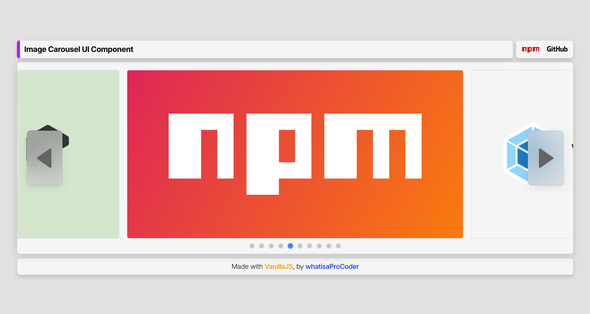

# Custom Image Carousel

A lightweight, easy-to-use image carousel component with navigation dots, arrow controls, and smooth scrolling. Perfect for showcasing images in a clean, responsive interface.


<p align="center">
  
</p>

**[Live Demo](https://whatisaprocoder.github.io/custom-image-carousel-component/)** - See the component in action!

## Features

- 🖼️ **Smooth Image Scrolling** - Seamless transition between images using CSS scroll snapping
- 🔢 **Navigation Dots** - Visual indicators showing current position in the carousel
- ⬅️ **Arrow Controls** - Intuitive navigation buttons that appear/disappear intelligently
- 📱 **Responsive Design** - Automatically adapts to different screen sizes
- 🔄 **Smart Navigation** - Arrows hide at the beginning/end of carousel for better UX
- 🚫 **Controlled Scrolling** - Prevents accidental user scrolling for more predictable behavior
- ✨ **Easy Integration** - Simple API with minimal configuration required
- 🪶 **Lightweight** - No external dependencies except for minimal CSS
- 🎯 **Targeted Design** - Clean interface focused on showcasing your images
- 🔄 **Auto Cycling** - Built-in support for automatic image cycling

## Installation

First, install the package in your project:

```bash
npm install @pd200x/custom-image-carousel
```

### Manual Installation (Without npm)

If you're not using npm, you can manually download and include these two essential files:

1. `custom-image-carousel.js` - The main component JavaScript file
2. `component.css` - The required CSS styles

You can find these files:

- From the GitHub repo:
  - `src/js/components/custom-image-carousel.js`
  - `src/css/component.css`

Then include them in your HTML:

```html
<link rel="stylesheet" href="path/to/component.css" />
<script src="path/to/custom-image-carousel.js"></script>
```

## Getting Started (Beginner-Friendly Guide)

### Step 1: Add a container element in your HTML

```html
<div id="my-carousel" style="height: 400px;"></div>
```

### Step 2: Import and use the component in your JavaScript

```javascript
// Import the component
import { CustomImageCarousel, ImageItem } from "@pd200x/custom-image-carousel";

// Create an array of image items
const imageItems = [
  new ImageItem({ src: "path/to/image1.jpg", scale: 1 }),
  new ImageItem({ src: "path/to/image2.jpg", scale: 1 }),
  new ImageItem({ src: "path/to/image3.jpg", scale: 1 }),
];

// Create and initialize the carousel
const carousel = new CustomImageCarousel({
  containerID: "my-carousel", // ID of your container from Step 1
  imageItemArray: imageItems, // Image items from above
});

// IMPORTANT: Always call initialise() to set up the carousel
carousel.initialise();
```

That's it! Your image carousel is ready to use.

## How to Customize the Look

You can easily change how the carousel looks by targeting these CSS classes:

### Main Classes You Can Style

- `.mcic-container` - The entire carousel container
- `.mcic-image-group` - The scrollable area containing images
- `.mcic-image-container` - Individual image containers
- `.mcic-navigation-dots-container` - Container for navigation dots
- `.mcic-navigation-dot` - Individual navigation dots
- `.mcic-navigation-dot-selected` - The currently selected dot
- `.mcic-left-arrow-button` - Left navigation arrow
- `.mcic-right-arrow-button` - Right navigation arrow

### Example: Custom Styling

```css
/* Make the carousel container more stylish */
.mcic-container {
  border-radius: 12px !important;
  box-shadow: 0 10px 30px rgba(0, 0, 0, 0.15) !important;
}

/* Style the navigation dots */
.mcic-navigation-dot {
  height: 12px !important;
  width: 12px !important;
  background-color: #e0e0e0 !important;
}

/* Style the selected dot */
.mcic-navigation-dot-selected {
  background-color: #4a5568 !important;
  transform: scale(1.2) !important;
}

/* Style the navigation arrows */
.mcic-left-arrow-button,
.mcic-right-arrow-button {
  background-color: rgba(255, 255, 255, 0.8) !important;
  border-radius: 50% !important;
  padding: 10px !important;
}
```

### Important Note about Styling

**You may need to use `!important` in your CSS rules** when customizing the component styles if your own CSS specificity is not high enough to override the component's built-in styles.

## Don't Forget to Initialize Your Carousel!

### The Critical Step: `initialise()`

After creating your carousel, you **must** call the `initialise()` method to make it work:

```javascript
// Create your carousel
const carousel = new CustomImageCarousel({
  // ...your options here
});

// ALWAYS do this or your carousel won't work!
carousel.initialise();
```

This step is essential because it:

- Creates the DOM structure for the carousel
- Sets up event listeners for controls
- Initializes the navigation system

## API Reference

### CustomImageCarousel Options

| Option           | Type        | Required | Description                                           |
| ---------------- | ----------- | -------- | ----------------------------------------------------- |
| `containerID`    | string      | Yes      | ID of the HTML element that will contain the carousel |
| `imageItemArray` | ImageItem[] | Yes      | Array of images to display in the carousel            |

### ImageItem Options

| Option  | Type   | Required | Description                            |
| ------- | ------ | -------- | -------------------------------------- |
| `src`   | string | Yes      | Path or URL to the image               |
| `scale` | number | Yes      | Scale factor for the image (usually 1) |

### Methods

| Method                          | Description                                                          |
| ------------------------------- | -------------------------------------------------------------------- |
| `initialise()`                  | **Required**: Sets up the carousel and returns the carousel instance |
| `displayItemNumber(itemNumber)` | Navigates to a specific item (1-based index)                         |
| `setCycle(delay)`               | Enables auto-cycling with the specified delay (seconds)              |
| `stopCycle()`                   | Stops auto-cycling behavior                                          |

## Common Examples

### Example 1: Product Gallery

```javascript
import { CustomImageCarousel, ImageItem } from "@pd200x/custom-image-carousel";

// Create and initialize a product gallery
const productGallery = new CustomImageCarousel({
  containerID: "product-gallery",
  imageItemArray: [
    new ImageItem({ src: "product-front.jpg", scale: 1 }),
    new ImageItem({ src: "product-back.jpg", scale: 1 }),
    new ImageItem({ src: "product-side.jpg", scale: 1 }),
    new ImageItem({ src: "product-detail.jpg", scale: 1 }),
  ],
}).initialise();
```

### Example 2: Using the Display Method

```javascript
// Create and initialize the carousel
const carousel = new CustomImageCarousel({
  containerID: "image-carousel",
  imageItemArray: [
    new ImageItem({ src: "image1.jpg", scale: 1 }),
    new ImageItem({ src: "image2.jpg", scale: 1 }),
    new ImageItem({ src: "image3.jpg", scale: 1 }),
    new ImageItem({ src: "image4.jpg", scale: 1 }),
    new ImageItem({ src: "image5.jpg", scale: 1 }),
  ],
}).initialise();

// Navigate to the third image (index is 1-based)
carousel.displayItemNumber(3);
```

### Example 3: Auto-Cycling Carousel

```javascript
// Create and initialize a carousel with auto-cycling
const autoCyclingCarousel = new CustomImageCarousel({
  containerID: "auto-carousel",
  imageItemArray: [
    new ImageItem({ src: "slide1.jpg", scale: 1 }),
    new ImageItem({ src: "slide2.jpg", scale: 1 }),
    new ImageItem({ src: "slide3.jpg", scale: 1 }),
  ],
}).initialise();

// Set up auto-cycling with 2 second delay
autoCyclingCarousel.setCycle(2);
```

## Browser Support

Works in all modern browsers including:

- Chrome, Firefox, Safari, Edge
- Mobile browsers (iOS Safari, Android Chrome)

## Performance Tips

For optimal performance, consider these tips:

- **Optimize Images**: Use modern formats like WebP and properly sized images
- **Height Management**: Setting a fixed height for the carousel container prevents layout shifts
- **Auto-cycling**: Use longer intervals (2-3 seconds) for better user experience

## License

ISC © [Pritam Debnath](https://github.com/whatisaProCoder)
